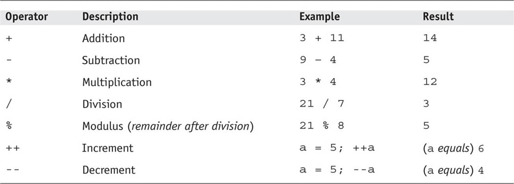

                                     JAVA SCRIPT
 >What is  Java script?
 >>JavaScript is a popular programming
language that has a wide range of
applications. 

_______                                                        
                                   History of java script


```                                      
               JavaScript was invented by Brendan Eich in 1995. It was   
               developed for Netscape 2, and became the ECMA-262 
               standard in 1997. After Netscape handed JavaScript over 
               to ECMA, the Mozilla foundation continued to develop 
               JavaScript for the Firefox browser. Mozilla's latest  version was 1.8
```
#Java Script Varable
### Verebl is divided into 2 parts
* #### Object
* #### Primitive
___
#Type of object && Primitive
Primitive | Object 
:---------|--------|
Number|Object interial 
String|Array
Boolean|Function
Undefined|Many  more
Null|
sumbol|
Bigint|

#JavaScript Arithmetic Operators

#LOGICAL OPERATORS

#Comparison operators

#Table of contents statement
* Condition
* Loops
* Fuction
#Condiion
* ## if/esle
* ## Terary operation
* ## Svich
#Loop
* for
* Wile
* do/while
#Fuction
* Declaretion
*   Immediately Invoked Function Expression
* Expression
##Declaretion 

## Immediately Invoked Function Expression

##  Expression
"# homework__" 
